# 🚀 Kraton - AI PPT Builder


---

## 📖 About The Project

**Kraton - AI PPT Builder** is a next-gen SaaS tool that helps you create beautiful, professional presentations in just **one click**. Using **AI (OpenAI GPT + DALL·E)**, Kraton generates slide outlines, themes, layouts, and visuals while allowing full customization with an intuitive **drag-and-drop editor**.

This project was built with **Next.js, Clerk, Prisma, and Lemon Squeezy** to ensure scalability, secure authentication, and monetization.

---

## ✨ Key Features

- 🔑 **Clerk Authentication** – Secure login and signup.
- 🧠 **AI Outline Generator** – Turn prompts into structured slides.
- 🎨 **Themes & Layouts** – Choose from prebuilt or AI-generated themes.
- 🖼 **AI-Powered Images** – Generate visuals using **DALL·E**.
- 🖱 **Drag-and-Drop Editor** – Fully customizable.
- 💾 **Save & Manage Projects** – Keep all your presentations in one place.
- 💳 **Monetization** – Integrated with **Lemon Squeezy**.

---

## 📸 Screenshots

### Landing Page


### Dashboard


### Project Creation


### Theme Generator


### Prompt Management


### Settings (API Integration)


### Recycle Bin


### Slides Edits


### Slide Show


---

## 🏗️ Architecture

The system architecture is built to balance **performance, scalability, and modularity**. It follows a **client-server model** with clear responsibilities:

- **Frontend (Next.js + TailwindCSS + ShadCN UI):** Renders the dashboard, editor, and presentation views. Handles client-side logic and state with **Zustand**.
- **Backend (Next.js API Routes):** Handles slide generation requests, image creation, and data persistence.
- **AI Integration (OpenAI GPT + DALL·E):** Powers content generation (outlines, text, images).
- **Database (Prisma + PostgreSQL):** Stores user accounts, projects, slides, and history.
- **Authentication (Clerk):** Provides secure user login and session management.
- **Payments (Lemon Squeezy):** Handles subscriptions and monetization for premium features.

```mermaid
graph TD
    subgraph Client
    U[User Browser] --> F[Next.js Frontend]
    end

    subgraph Backend
    F --> API[Next.js API Routes]
    API --> AI[OpenAI GPT & DALL·E]
    API --> DB[(PostgreSQL via Prisma)]
    end

    subgraph Services
    F --> Clerk[Clerk Auth]
    API --> LS[Lemon Squeezy]
    end

    U -->|Login| Clerk
    Clerk --> F
    U -->|Buy Premium| LS
    LS --> API
```



---

## 🛠 Built With

- **Frontend:** Next.js 15, TypeScript, TailwindCSS, ShadCN UI
- **Backend:** Prisma ORM, PostgreSQL
- **AI:** OpenAI GPT + DALL·E
- **Auth:** Clerk
- **Payments:** Lemon Squeezy
- **State Management:** Zustand

---

## ⚙️ Getting Started

### Prerequisites

- Node.js 18+
- PostgreSQL instance
- OpenAI API Key
- Clerk API Key
- Lemon Squeezy API Key

### Installation

```bash
git clone https://github.com/username/ai-ppt-builder.git
cd ai-ppt-builder
npm install
```

### Configuration

Rename `.env.example` to `.env.local` and update:

```env
DATABASE_URL=your_postgres_url
OPENAI_API_KEY=your_openai_key
CLERK_SECRET_KEY=your_clerk_secret
LEMON_SQUEEZY_API_KEY=your_api_key
```

### Database Setup (Prisma)

1. Install Prisma CLI:
```bash
npm install prisma --save-dev
```

2. Initialize Prisma:
```bash
npx prisma init
```

3. Generate Prisma client:
```bash
npx prisma generate
```

4. Push database schema to PostgreSQL:
```bash
npx prisma db push
```

5. (Optional) Open Prisma Studio to explore/manage DB:
```bash
npx prisma studio
```

### Run

```bash
npm run dev
```

Visit [http://localhost:3000](http://localhost:3000)

---

## 🛣️ Roadmap

- [x] AI Slide Generator
- [x] AI Themes & Images
- [x] Clerk Authentication
- [x] Lemon Squeezy Integration
- [ ] Team Collaboration
- [ ] Export as PPTX/PDF
- [ ] Cloud Deployment (Vercel/AWS)

---

## 📜 License

MIT License © 2025 Aryan Baadlas

---

## 📬 Contact

👨‍💻 **Aryan Baadlas**  
📧 **aryanbaadlas@gmail.com**
